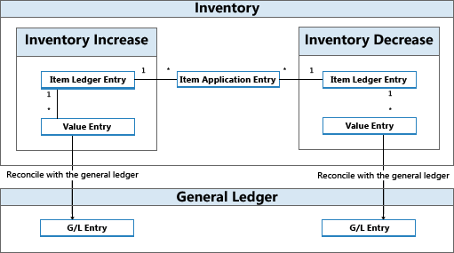

# Détails de conception : comptabilisation stockDesign Details: Inventory Posting
Chaque mouvement stock, par exemple une réception achat ou une expédition vente, valide deux écritures de différents types.Each inventory transaction, such as a purchase receipt or a sales shipment, posts two entries of different types.  

|Type écritureEntry type|DésignationDescription|  
|----------------|---------------------------------------|  
|QuantitéQuantity|Reflète la modification de la quantité en stock.Reflects the change of quantity in inventory. Ces informations sont stockées dans les écritures comptables article.This information is stored in item ledger entries.   Accompagné des écritures lettrage article.Accompanied by item application entries.|  
|ValeurValue|Reflète la modification de la valeur stock.Reflects the change of inventory value. Ces informations sont stockées dans les écritures valeur.This information is stored in value entries.   Chaque écriture comptable article ou écriture comptable capacité peut posséder une ou plusieurs écritures valeur.One or more value entries can exist for each item ledger entry or capacity ledger entry.   Pour plus d'informations sur les écritures de valeur de capacité liées à l'utilisation des ressources de production ou d'assemblage, reportez\-vous à [Détails de conception : validation d'ordre de fabrication](design-details-production-order-posting.md).For information about capacity value entries related to the use of production or assembly resources, see [Design Details: Production Order Posting](design-details-production-order-posting.md).|  

 En rapport avec les validations de quantité, les écritures lettrage article existent pour lier l'entrée de stock avec la sortie de stock.In relation to quantity postings, item application entries exist to link inventory increase with inventory decrease. Cela permet au moteur d'évaluation de transférer les cous des augmentations aux diminutions liées et vice versa.This enables the costing engine to forward costs from increases to the related decreases and vice versa. Pour plus d'informations, voir [Détails de conception : traçabilité](design-details-item-application.md).For more information, see [Design Details: Item Application](design-details-item-application.md).  

 Les écritures comptables article, les écritures valeur, ainsi que les écritures lettrage article sont créées suite à la validation d'une ligne feuille article, soit indirectement lors de la validation d'une ligne commande, soit directement dans la fenêtre feuille article.Item ledger entries, value entries, and item application entries are created as a result of posting an item journal line, either indirectly by posting an order line or directly in the Item Journal window.  

 À intervalles réguliers, les écritures valeur créées parmi les écritures comptables d'inventaire sont validées en comptabilité pour rapprocher les deux comptabilités à des fins de contrôle financier.At regular intervals, value entries that are created in the inventory ledger are posted to the general ledger to reconcile the two ledgers for financial control reasons. Pour plus d'informations, voir [Détails de conception : rapprochement de comptabilité](design-details-reconciliation-with-the-general-ledger.md).For more information, see [Design Details: Reconciliation with the General Ledger](design-details-reconciliation-with-the-general-ledger.md).  

   

## Exemple :Example  
 L'exemple suivant indique comment les écritures comptables article, les écritures valeur et les écritures lettrage article créent des écritures comptables.The following example shows how item ledger entries, value entries, and item application entries result in general ledger entries.  

 Vous validez une commande achat comme reçue et facturée pour 10 articles avec un coût unitaire direct de 7 LCY et des frais généraux d'1 LCY.You post a purchase order as received and invoiced for 10 items with a direct unit cost of LCY 7 and an overhead rate of LCY 1. La date comptabilisation est 01-01-20.The posting date is 01-01-20. Les écritures suivantes sont créées.The following entries are created.  

 **Écritures comptables article****Item Ledger Entries**  

|Date comptabilisationPosting Date|Type écritureEntry Type|Coût total (réel)Cost Amount (Actual)|QuantitéQuantity|Numéro de la séquenceEntry No.|  
|------------------|----------------|----------------------------|--------------|---------------|  
|01/01/2001-01-20|AchatsPurchase|80,0080.00|1010|11|  

 **Ecritures valeur****Value Entries**  

|Date comptabilisationPosting Date|Type écritureEntry Type|Coût total (réel)Cost Amount (Actual)|N° séquence écriture comptable articleItem Ledger Entry No.|Numéro de la séquenceEntry No.|  
|------------------|----------------|----------------------------|---------------------------|---------------|  
|01/01/2001-01-20|Coût directDirect Cost|70,0070.00|11|11|  
|01/01/2001-01-20|Coût indirectIndirect Cost|10,0010.00|11|22|  

 **Écritures lettrage article****Item Application Entries**  

|Numéro de la séquenceEntry No.|N° séquence écriture comptable articleItem Ledger Entry No.|N° écriture article entrantInbound Item Entry No.|N° écriture article sortantOutbound Item Entry No.|QuantitéQuantity|  
|---------------|---------------------------|----------------------------|-----------------------------|--------------|  
|11|11|11|00|1010|  

 Ensuite, vous validez une vente de 10 unités de l'article avec une date validation de 15/01/20.Next, you post a sale of 10 units of the item with a posting date of 01-15-20.  

 **Écritures comptables article****Item Ledger Entries**  

|Date comptabilisationPosting Date|Type écritureEntry Type|Coût total (réel)Cost Amount (Actual)||QuantitéQuantity|Numéro de la séquenceEntry No.|  
|------------------|----------------|----------------------------|-|--------------|---------------|  
|15/01/2001-15-20|VenteSale|-80,00-80.00||-10-10|22|  

 **Ecritures valeur****Value Entries**  

|Date comptabilisationPosting Date|Type écritureEntry Type|Coût total (réel)Cost Amount (Actual)|N° séquence écriture comptable articleItem Ledger Entry No.|Numéro de la séquenceEntry No.|  
|------------------|----------------|----------------------------|---------------------------|---------------|  
|15/01/2001-15-20|Coût directDirect Cost|-80,00-80.00|22|33|  

 **Écritures lettrage article****Item Application Entries**  

|Numéro de la séquenceEntry No.|N° séquence écriture comptable articleItem Ledger Entry No.|N° écriture article entrantInbound Item Entry No.|N° écriture article sortantOutbound Item Entry No.|QuantitéQuantity|  
|---------------|---------------------------|----------------------------|-----------------------------|--------------|  
|22|22|01|22|-10-10|  

 À la fin de la période comptable, vous exécutez le traitement par lots **Valider coûts ajustés** pour effectuer un rapprochement entre ces mouvements de stock et la comptabilité.At the end of the accounting period, you run the **Post Inventory Cost to G/L** batch job to reconcile these inventory transactions with the general ledger.  

 Pour plus d'informations, voir [Détails de conception : comptes de la comptabilité](design-details-accounts-in-the-general-ledger.md).For more information, see [Design Details: Accounts in the General Ledger](design-details-accounts-in-the-general-ledger.md).  

 Les tables suivantes indiquent le résultat du rapprochement des mouvements de stock de cet exemple avec la comptabilité.The following tables show the result of reconciling the inventory transactions in this example with the general ledger.  

 **Ecritures valeur****Value Entries**  

|Date comptabilisationPosting Date|Type écritureEntry Type|Coût total (réel)Cost Amount (Actual)|Coût validé en comptabilitéCost Posted to G/L|N° séquence écriture comptable articleItem Ledger Entry No.|Numéro de la séquenceEntry No.|  
|------------------|----------------|----------------------------|-------------------------|---------------------------|---------------|  
|01/01/2001-01-20|Coût directDirect Cost|70,0070.00|70,0070.00|11|11|  
|01/01/2001-01-20|Coût indirectIndirect Cost|10,0010.00|10,0010.00|11|22|  
|15/01/2001-15-20|Coût directDirect Cost|-80,00-80.00|-80,00-80.00|22|33|  

 **Écritures comptables****General Ledger Entries**  

|Date comptabilisationPosting Date|Compte généralG/L Account|N° compte (démonstration Fr-FR)Account No. (En-US Demo)||MontantAmount|Numéro de la séquenceEntry No.|  
|------------------|------------------|---------------------------------|-|------------|---------------|  
|01/01/2001-01-20|[Compte stocks][Inventory Account]|2 1302130||70,0070.00|11|  
|01/01/2001-01-20|[Compte coût direct lettré][Direct Cost Applied Account]|7 2917291||-70,00-70.00|22|  
|01/01/2001-01-20|[Compte stocks][Inventory Account]|2 1302130||10,0010.00|33|  
|01-01-0701-01-07|[Compte frais généraux lettrés][Overhead Applied Account]|7 2927292||-10,00-10.00|44|  
|15/01/2001-15-20|[Compte stocks][Inventory Account]|2 1302130||-80,00-80.00|55|  
|15/01/2001-15-20|[Compte variation stock][COGS Account]|7 2907290||80,0080.00|66|  

> [!NOTE]  
>  La date comptabilisation des écritures comptables est la même que pour les écritures valeur associées.The posting date of the general ledger entries is the same as for the related value entries.  
>   
>  Le champ **Coût validé en comptabilité** de la table **Ecritures valeur** est renseigné.The **Cost Posted to G/L** field in the **Value Entry** table is filled.  

 La relation entre les écritures valeur et les écritures comptables est stockée dans la table **Compta. Relation écritures article**.The relation between value entries and general ledger entries is stored in the **G/L - Item Ledger Relation** table.  

 **Liens écritures dans la comptabilité – Table Écriture comptable article****Relation Entries in the G/L – Item Ledger Relation table**  

|N° séquence compta.G/L Entry No.|N° écriture valeurValue Entry No.|N° hist. transaction compta.G/L Register No.|  
|--------------------|---------------------|-----------------------|  
|11|11|11|  
|22|11|11|  
|33|22|11|  
|44|22|11|  
|55|33|11|  
|66|33|11|  

## Validation d'assemblage et de productionAssembly and Production Posting  
Les écritures comptables capacité et ressource représentent le délai qui est validé comme étant consommé dans la production ou l'assemblage.Capacity and resource ledger entries represent the time that is posted as consumed in production or assembly. Ces coûts opératoires sont validés comme écritures valeur en comptabilité en même temps que les coûts matière impliqués dans une structure similaire telle que décrite pour les écritures comptables article de cette rubrique.These process costs are posted as value entries to the general ledger along with the involved material costs in a similar structure as described for item ledger entries in this topic.  

Pour plus d'informations, voir [Détails de conception : modes évaluation stock](design-details-assembly-order-posting.md).For more information, see [Design Details: Assembly Order Posting](design-details-assembly-order-posting.md).  

## Voir aussiSee Also  
 [Détails de conception : évaluation stock](design-details-inventory-costing.md) [Design Details: Inventory Costing](design-details-inventory-costing.md)   
 [Détails de conception : comptes de la comptabilité](design-details-accounts-in-the-general-ledger.md) [Design Details: Accounts in the General Ledger](design-details-accounts-in-the-general-ledger.md)   
 [Détails de conception : Ajustement des coûts](design-details-cost-components.md) [Gestion des composants des coûts](finance-manage-inventory-costs.md)[Design Details: Cost Components](design-details-cost-components.md) [Managing Inventory Costs](finance-manage-inventory-costs.md)  
 [FinancesFinance](finance.md)  
 [Utilisation de [!INCLUDE[d365fin](includes/d365fin_md.md)]](ui-work-product.md)[Working with [!INCLUDE[d365fin](includes/d365fin_md.md)]](ui-work-product.md)

